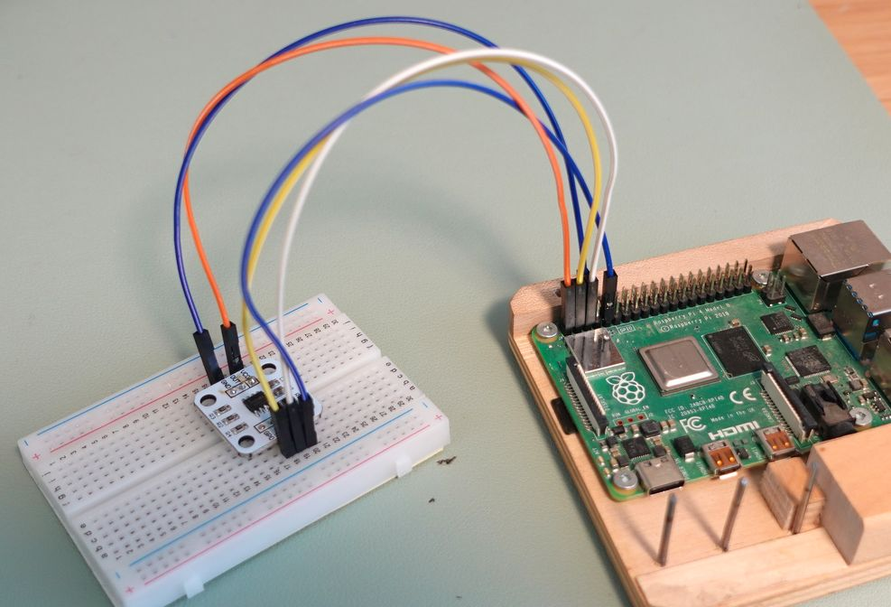
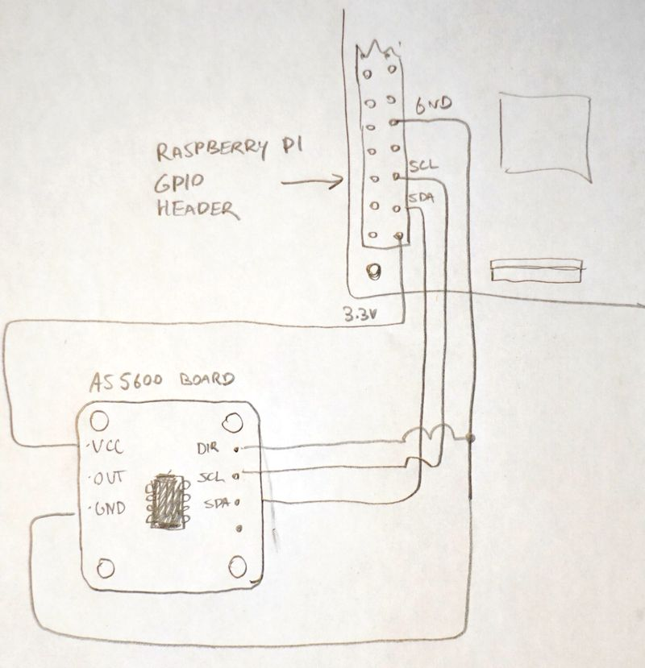

<html>
<h1>Connecting AS5600 magnetic encoder to Raspberry Pi, using Python</h1>

The AS5600 chip is a magnetic rotary encoder, containing two hall effect sensors
tha enalbe it to accurately measure the angle and magnitude of a magnetic field.

Rotating a magnet above the chip allows it to act as a rotary encoder.

Talking to the AS5600 turns out to be simple, but I found no example code for
this on the internet.  I always prefer to start with a working example before
changing any code.

So I added this github repository as an example for others to find as a starting point.

 

<b>Physical wring to Raspberry Pi 40-pin GPIO header:</b>
<table>
<tr><th>Pi pin<th>Pi function<th>AS5600 board
<tr><td>01<td>3.3V DC power<td>VCC
<tr><td>03<td>GPIO 02 / I2C SDA<td>SDA
<tr><td>05<td>GPIO 03 / I2C SCL<td>SCL
<tr><td>09<td>Ground<td>GROUND and DIR
</table>

The actual code to talk to the AS5600 chip is just 9 lines of python:
<pre>
import smbus
DEVICE_AS5600 = 0x36 # Default device I2C address
bus = smbus.SMBus(1)

def ReadRawAngle(): # Read angle (0-360 represented as 0-4096)
  read_bytes = bus.read_i2c_block_data(DEVICE_AS5600, 0x0C, 2)
  return (read_bytes[0]<<8) | read_bytes[1];

def ReadMagnitude(): # Read magnetism magnitude
  read_bytes = bus.read_i2c_block_data(DEVICE_AS5600, 0x1B, 2)
  return (read_bytes[0]<<8) | read_bytes[1];
</pre>

This code is contained in several stand alone python programs in this
repository which I used for testing the AS5600 chip.

I used a stepper motor to rotate the magnet to check for accuracy.

I found the AS5600 provided good 12 bit precision, with little jitter
for the rotation angle, but absolute rotational accuracy depends on having
the magnet exactly centered above the chip.  Without a precision machined
jig or 3d printed jig, It is unlikely that you will be able to position
the magnet accurately enough to have less than 1 degree
error variation over a full rotation.

